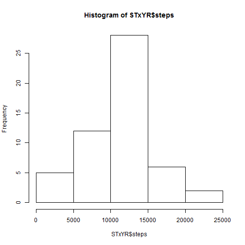
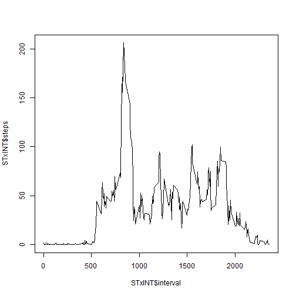
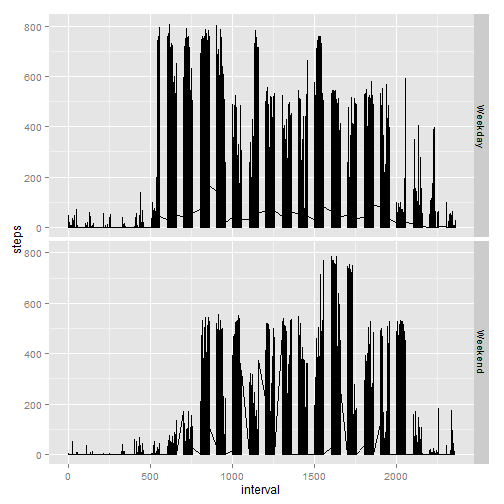

# Loading and preprocessing the data


```r
setwd("C:/Users/Claudiokass/Desktop/R")
stepsdata<-read.csv("activity.csv",sep=",",header=T)
```

# What is mean total number of steps taken per day?


```r
STxYR<-aggregate(steps ~ date, data=stepsdata, FUN=sum)
hist(STxYR$steps)
```

 

```r
mean(STxYR$steps,na.rm=T)
```

```
## [1] 10766.19
```


```r
median(STxYR$steps,na.rm=T)
```

```
## [1] 10765
```
# What is the average daily activity pattern?


```r
STxINT<-aggregate(steps ~ interval, data=stepsdata, FUN=mean)
plot(STxINT$interval,STxINT$steps,type="l")
```

 


```r
STxINT[which.max(STxINT$steps),"interval"]
```

```
## [1] 835
```

# Imputing missing values


```r
sum(is.na(stepsdata))
```

```
## [1] 2304
```

Created a new variable on original database: step mean for every 5-minute interval across the days so that they will fill NA row in "step" field.


```r
library(plyr)
stepsdata<-ddply(stepsdata,("interval"),transform,intmean =  mean(steps,na.rm=T))
```


```r
r<-nrow(stepsdata)
for(i in 1:r){if (is.na(stepsdata[i,"steps"])){stepsdata[i,"steps"]<-stepsdata[i,"intmean"]}}

fSTxYR<-aggregate(steps ~ date, data=stepsdata, FUN=sum)
hist(STxYR$steps)
```

 

As shown below, mean and median are not sensibly different from what has been calculated at the beginning of the report.


```r
mean(fSTxYR$steps)
```

```
## [1] 10766.19
```


```r
median(fSTxYR$steps,na.rm=T)
```

```
## [1] 10766.19
```

# Are there differences in activity patterns between weekdays and weekends?


```r
r<-nrow(stepsdata)
for(i in 1:r){if (weekdays(as.Date(stepsdata$date[i]))=="Saturday" | weekdays(as.Date(stepsdata$date[i]))=="Sunday"){stepsdata[i,"WD"]<-"Weekend"}else{stepsdata[i,"WD"]<-"Weekday"}}
library(ggplot2)
stepsdata<-ddply(stepsdata,c("interval","WD"),transform,intmean = mean(steps,na.rm=T))
qplot(interval,steps, data=stepsdata, geom="line")+facet_grid(WD ~.)
```

 
